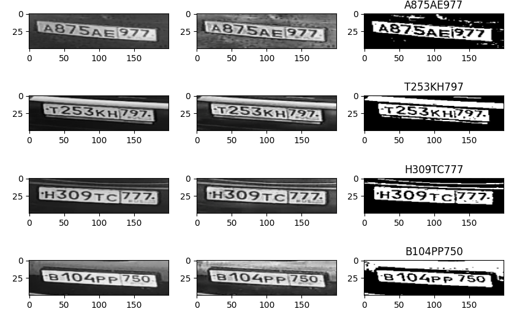
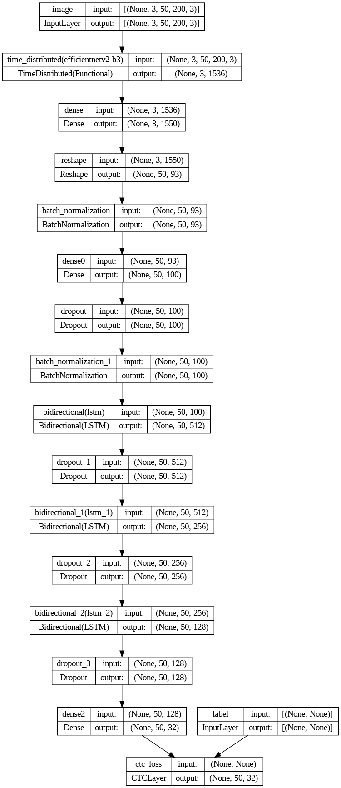
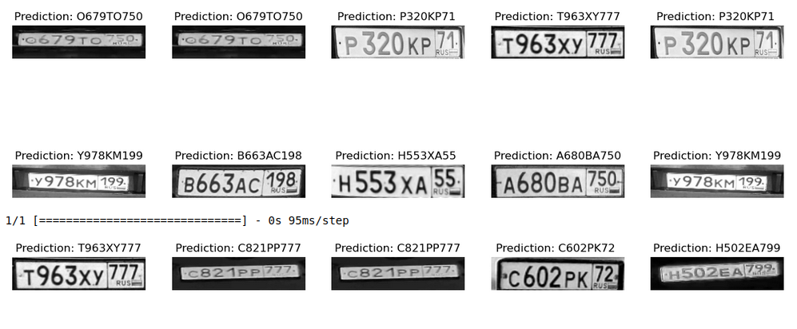

# Поиск и распознавание номеров в потоке данных от видеокамеры

## Описание проекта и используемые технологии

Проект создан для фиксации номеров подъезжающих к шлагбауму автомашин с российскими номерами по поступающему
видеопотоку видеокамеры. Изображение идет непрерывно, необходимо записывать номер проезжающей машины в базу
данных PostgreSQL в процессе.

Для вырезания номеров из входящего потока используется [YOLOv5](https://github.com/ultralytics/yolov5). Для дальнейшего распознавания текста изображения
используется созданная на TensorFlow модель, принимающая изображение размером (50,200,3), а как результат -
текст. Возвращаемые символы - ' ', '-', '0', '1', '2', '3', '4', '5', '6', '7', '8', '9', 'A', 'B', 'C', 'D', 'E', 'F',
'H', 'I', 'K', 'M', 'N', 'O', 'P', 'S', 'T', 'X', 'Y', '_' - латиницей, остальные символы не возвращаются, так как
не используются в российских номерах.

| Имя файла     | Назначение                                                                                                                                                            |
|:---: |-----------------------------------------------------------------------------------------------------------------------------------------------------------------------|
| *detect.py*   | нахождение номеров на изображении, вырезка их и передача их для распознавания                                                                                         |
| *plots.py*    | проверка попадания изображения в нужные рамки                                                                                                                         |
| *ocr.py*      | подготовка вырезанного изображения к передаче в модель, и получение текста (Для большей уверенности дополнительно используется модель распознавания символов EasyOCR) |
| *prepare.py*  | выбор из результатов наиболее часто встречающихся наборов символов и проверка их на соответствие шаблонам номеров                                                     |
| *model.py*    | построение модели для распознавания номеров                                                                                                                           |
| *model_pe.py* | модель для использования с ORM Peewee для PostgreSQL                                                                                                                  |
| *add.py*      | добавление записи в базу данных                                                                                                                                       |
| *settings.py* | установки для запуска системы                                                                                                                                         |

## Установка

1) Клонируем репозиторий
```bash
git clone https://github.com/windn19/NumSteam1.git
```

2) Устанавливаем зависимости
```bash
pip install -r requirements.txt
```

3) Заполняем *settings.py*
   - yolo_weights - веса для нахождения номеров на изображении
   - ocr_weights - веса для распознавания номеров  
   - source - источник данных (ожидается url c видеопотоком от камеры)
   - postgre - словарь с данными PostgreSQL: имя базы данных, логин, пароль, хост

4) Запускаем файл *start.py*
```bash
python start.py
```
5) Запись в базу 

## Результаты

**Входящие изображения модель обрабатывает различными способами и выравнивает по горизонтали:**



**Схема модели для распознавания текста на номерах:** 


**Результаты:**




Общая точность получилась в районе 0.96.

## Дальнейшая работа
Осложнения связаны с тем, что LSTM - распознает только известные  последовательности, и при получении новой
последовательности, может терятся, то есть неправильно распознаются известные цифры в неизвестной последовательности -
новые регионы, номера из других стран и тому подобное. Проводится дообучение модели для улучшения результата.


